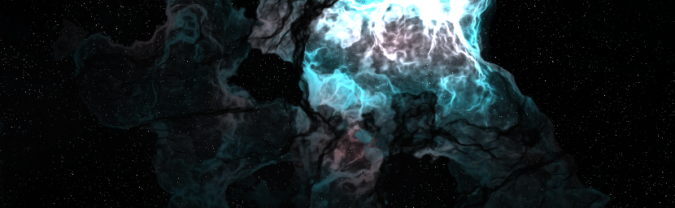
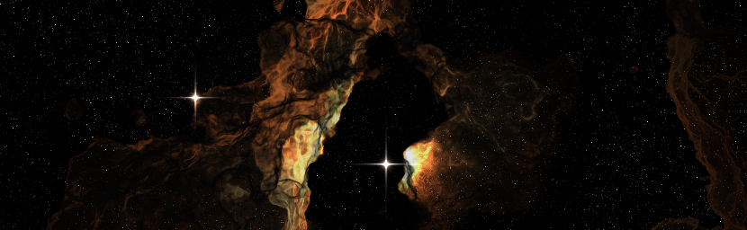
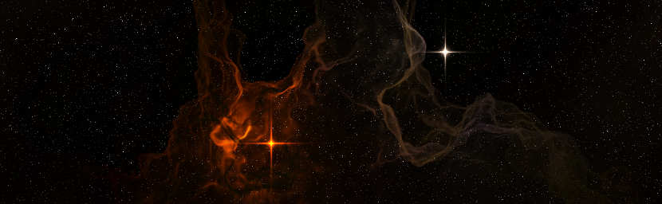
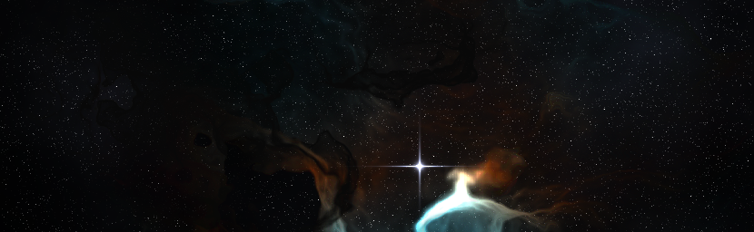
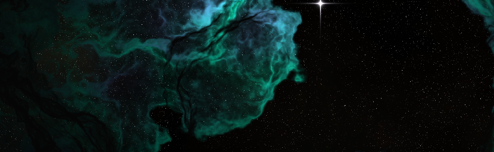
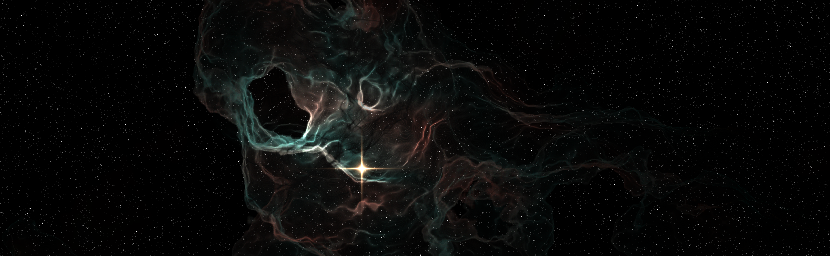
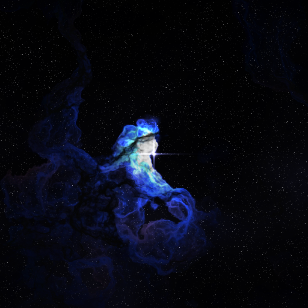

# Space Scene 2D

Procedural generator for 2D space scenes.

<p align="center">
  
</p>
<p align="center">
  
</p>
<p align="center">
  
</p>
<p align="center">
  
</p>
<p align="center">
  
</p>
<p align="center">
  
</p>

## Install

```
npm i space-scene-2d
```

## Example

```ts
import { Space2D } from "space-scene-2d";

const space2d = new Space2D();

const canvas = space2d.render(512, 512, {
  nebulaAlbedoLow: [0.1, 0.25, 0.5],
  nebulaAlbedoHigh: [0.5, 0.25, 0.1],
  nebulaFalloff: 512,
  nebulaAbsorption: 1.0,
  nebulaDensity: 0.1,
  nebulaAlbedoScale: 5,
  stars: [
    {
      position: [256, 256, 350],
      color: [0.1375, 0.1375, 0.25],
      falloff: 256,
      diffractionSpikeFalloff: 1024,
      diffractionSpikeScale: 8,
    },
  ],
});

document.body.appendChild(canvas);
```

<p align="center">
  
</p>

## API

### Constructor

```ts
const space2d = new Space2D();
```

### Methods

```ts
space2d.render(width: number, height: number, parameters: RenderParameters): HTMLCanvasElement
```

Renders the space scene. Returns an HTMLCanvasElement with the rendered scene.

| Parameter   | Type             | Description                                    |
| ----------- | ---------------- | ---------------------------------------------- |
| width       | number           | The width of the rendered scene in pixels.     |
| height      | number           | The height of the rendered scene in pixels.    |
| parameters? | RenderParameters | Optional. See definition of `RenderParameters` |

### Types

#### `RenderParameters`

| Field                     | Type                     | Default              | Description                                                                                                                       |
| ------------------------- | ------------------------ | -------------------- | --------------------------------------------------------------------------------------------------------------------------------- |
| scale?                    | number                   | 0.002                | How zoomed out the camera is. Larger value is zoomed out more.                                                                    |
| offset?                   | [number, number]         | [0, 0]               | The location of the lower-left corner of the scene.                                                                               |
| backgroundColor?          | [number, number, number] | [0.125, 0.125, 0.25] | The color of the background noise pattern.                                                                                        |
| backgroundDepth?          | number                   | 137.0                | How far in the z-direction the background noise pattern is sliced out of 3D noise.                                                |
| backgroundLacunarity?     | number                   | 2.0                  | The frequency multiplier for each octave of background noise. Numbers closer to one result in smoother noise.                     |
| backgroundGain?           | number                   | 0.5                  | The magnitude multiplier for each octave of background noise. Numbers closer to one result in smoother noise.                     |
| backgroundOctaves?        | number                   | 8                    | The number of octaves of background noise.                                                                                        |
| backgroundDensity?        | number                   | 2.0                  | A scaling factor applied after the background noise is calculated. Larger numbers result in greater density.                      |
| backgroundFalloff?        | number                   | 8.0                  | An exponential factor applied after the background noise is calculated. Larger numbers result in a more rapid falloff in density. |
| backgroundScale?          | number                   | 0.003                | How zoomed out the camera is for the background noise.                                                                            |
| backgroundStarDensity?    | number                   | 0.05                 | The density of the background stars.                                                                                              |
| backgroundStarBrightness? | number                   | 0.125                | How bright the background stars are.                                                                                              |
| nebulaNear?               | number                   | 0.0                  | The near plane of the nebula noise layers.                                                                                        |
| nebulaFar?                | number                   | 500.0                | The far plane of the nebula noise layers.                                                                                         |
| nebulaLayers?             | number                   | 1000                 | The number of nebula noise layers.                                                                                                |
| nebulaAbsorption?         | number                   | 1.0                  | How much light is absorbed by each layer as a function of the density at each point.                                              |
| nebulaLacunarity?         | number                   | 2.0                  | The frequency multiplier for each octave of nebula noise. Numbers closer to one result in smoother noise.                         |
| nebulaGain?               | number                   | 0.5                  | The magnitude multiplier for each octave of nebula noise. Numbers closer to one result in smoother noise.                         |
| nebulaOctaves?            | number                   | 7                    | The number of octaves of nebula noise.                                                                                            |
| nebulaDensity?            | number                   | 0.1                  | A scaling factor applied after the nebula noise is calculated. Larger numbers result in greater density.                          |
| nebulaFalloff?            | number                   | 4.0                  | An exponential factor applied after the nebula noise is calculated. Larger numbers result in a more rapid falloff in density.     |
| nebulaEmissiveLow?        | [number, number, number] | [0, 0, 0]            | One of two colors mixed to calculate a final emissive color for the nebula. All zeros disables emissivity.                        |
| nebulaEmissiveHigh?       | [number, number, number] | [0, 0, 0]            | One of two colors mixed to calculate a final emissive color for the nebula. All zeros disables emissivity.                        |
| nebulaEmissiveOffset?     | [number, number, number] | [0, 0, 0]            | The offset into the perlin noise function used to determine a mixing coefficient for the emissive color.                          |
| nebulaEmissiveScale?      | number                   | 1.0                  | The frequency multiplier applied to the perlin noise function used to determine a mixing coefficient for the emissive color.      |
| nebulaAlbedoLow?          | [number, number, number] | [1, 1, 1]            | One of two colors mixed to calculate a final albedo color for the nebula.                                                         |
| nebulaAlbedoHigh?         | [number, number, number] | [1, 1, 1]            | One of two colors mixed to calculate a final albedo color for the nebula.                                                         |
| nebulaAlbedoOffset?       | [number, number, number] | [0, 0, 0]            | The offset into the perlin noise function used to determine a mixing coefficient for the albedo color.                            |
| nebulaAlbedoScale?        | number                   | 1.0                  | The frequency multiplier applied to the perlin noise function used to determine a mixing coefficient for the albedo color.        |
| stars?                    | Star[]                   | []                   | A list of Star objects to use during this render. See definition of `Star`.                                                       |

#### `Star`

| Field                    | Type                     | Description                                                                                                                                    |
| ------------------------ | ------------------------ | ---------------------------------------------------------------------------------------------------------------------------------------------- |
| position?                | [number, number, number] | The x, y, and z coordinates of the star. These values are relative to the `offset`, `nebulaNear` and `nebulaFar` values of `RenderParameters`. |
| color?                   | [number, number, number] | The red, green, and blue components of the star color.                                                                                         |
| falloff?                 | number                   | An exponential factor applied to the body of the star. Larger values result in smaller star radii.                                             |
| diffractionSpikeFalloff? | number                   | An exponential factor applied to the width of the star diffraction spikes. Larger values result in narrower spikes.                            |
| diffractionSpikeScale?   | number                   | A scaling factor applied to the length of the star diffraction spikes. Larger values result in longer spikes.                                  |
